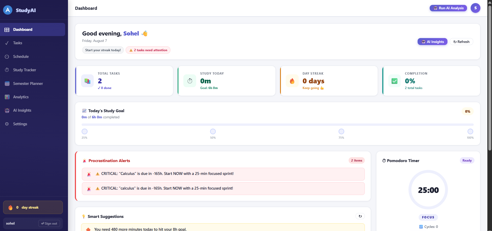
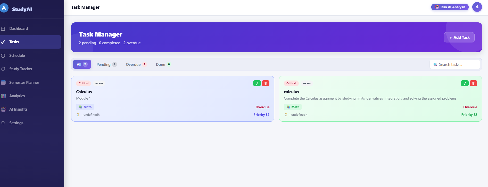
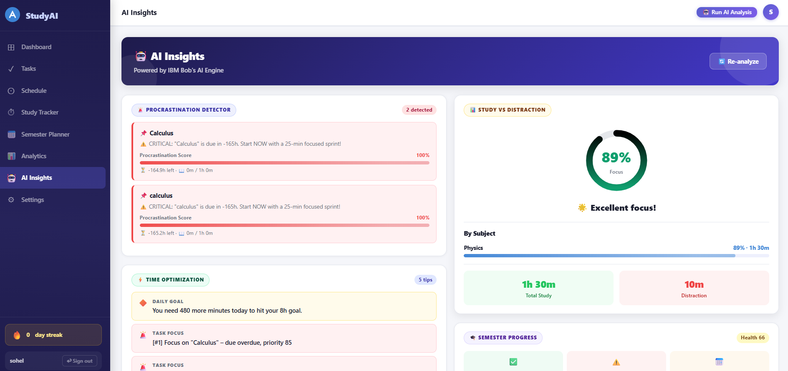
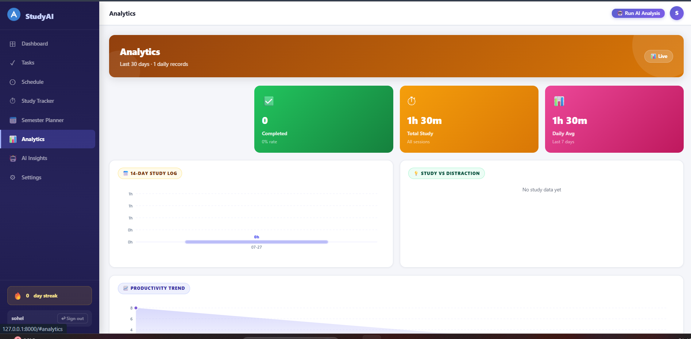
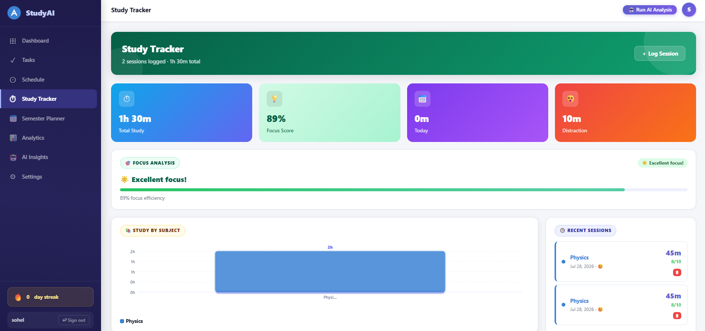
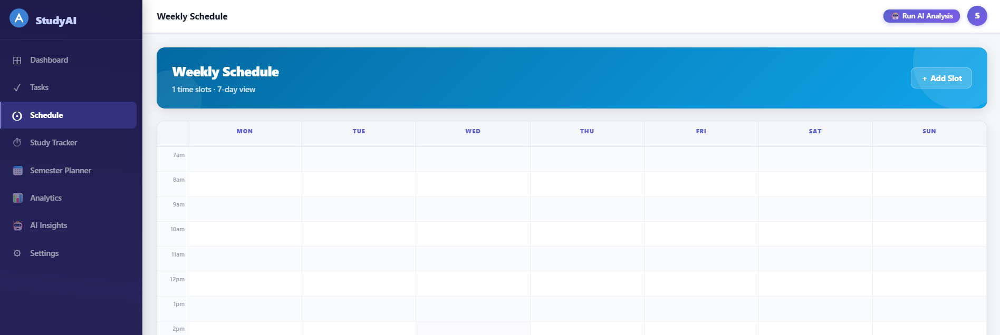
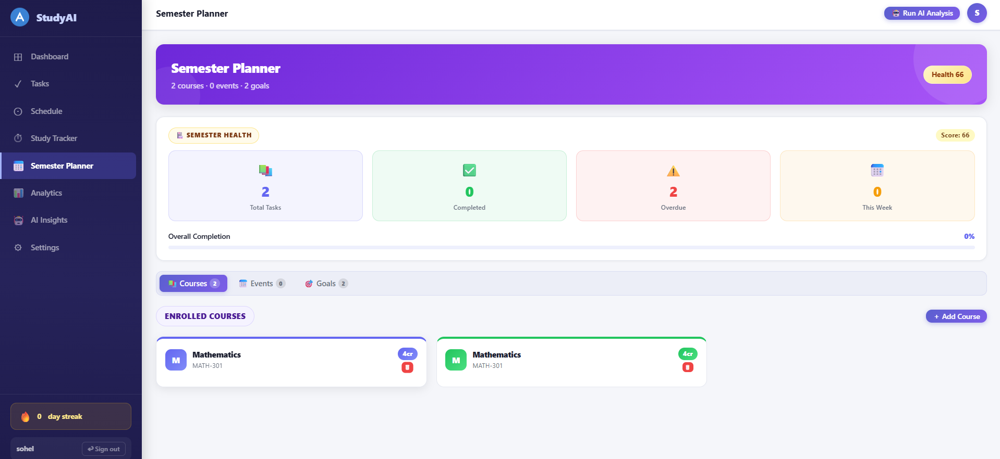

<div align="center">

<h1>🎓 StudyAI — AI-Powered Student Productivity Assistant</h1>

<p><strong>Tasks · Study Tracker · Pomodoro Timer · Semester Planner · AI Insights · Analytics</strong></p>

<p>
  
  
  
  
  
  
  
  
  
  
</p>

<p>
  <a href="#-features">Features</a> ·
  <a href="#%EF%B8%8F-architecture">Architecture</a> ·
  <a href="#-quick-start">Quick Start</a> ·
  <a href="#-api-reference">API Reference</a> ·
  <a href="#-ai-engine">AI Engine</a> ·
  <a href="#-docker">Docker</a> ·
  <a href="#-deploy">Deploy</a> ·
  <a href="#-testing">Testing</a>
</p>

</div>

---

## 📸 Screenshots

| Dashboard | Task Manager | AI Insights |
|-----------|-------------|-------------|
|  |  |  |

| Analytics | Study Tracker | Weekly Schedule | Semester Planner |
|-----------|---------------|-----------------|-----------------|
|  |  |  |  |

---

## ✨ Features

| Module | Description |
|--------|-------------|
| 📊 **Dashboard** | Live stats, AI-generated alerts, Pomodoro timer, 7-day study chart |
| ✅ **Task Manager** | Create, complete and delete tasks with AI priority scoring (0–100) |
| 🗓 **Weekly Schedule** | Visual timetable — add study, class, break and exercise slots |
| ⏱ **Study Tracker** | Log sessions with subject, mood, productivity score and distraction minutes |
| 📅 **Semester Planner** | Manage courses, academic events (exams, deadlines) and semester goals |
| 📈 **Analytics** | 14-day bar chart, focus-vs-distraction donut, productivity trend line |
| 🤖 **AI Insights** | Procrastination detector, time-block suggestions, semester health score |
| ⚙️ **Settings** | Student profile, daily study goal, Pomodoro work/break durations |
| 🔐 **Auth** | Register / login / logout via Django session auth |

---

## 🏗️ Architecture

StudyAI ships with **two parallel backends** that share the same Vanilla JS / React frontend:

```
┌─────────────────────────────────────────────────────────┐
│               Frontend (SPA)                             │
│  public/        → Vanilla HTML + CSS + JS (no build)     │
│  react-app/     → React 18 + TypeScript + Vite           │
└────────────────────┬────────────────────────────────────┘
                     │  REST API  /api/*
          ┌──────────┴──────────┐
          │                     │
  ┌───────▼──────┐    ┌─────────▼────────┐
  │  Node.js /   │    │   Django 4.2 /    │
  │  Express 4   │    │   DRF 3.14        │
  │  server/     │    │   api/  studyai/  │
  │  JSON files  │    │   SQLite DB       │
  └──────────────┘    └──────────────────┘
```

> Use the **Node.js stack** for a zero-dependency, zero-migration quick start.  
> Use the **Django stack** when you need a proper relational database, Django Admin, and session-based auth.

---

## 📁 Project Structure

```
ai-student-productivity/
│
├── ── NODE.JS / EXPRESS BACKEND ──────────────────────────
│
├── server/
│   ├── index.js                ← Entry point, middleware, SPA fallback, cron
│   ├── routes/
│   │   ├── tasks.js            ← CRUD tasks + AI priority
│   │   ├── schedule.js         ← Weekly timetable slots
│   │   ├── studySessions.js    ← Log & analyse study sessions
│   │   ├── semester.js         ← Courses, events, goals
│   │   ├── analytics.js        ← Charts & daily logs
│   │   └── ai.js               ← AI analysis endpoints
│   ├── services/
│   │   ├── aiEngine.js         ← Priority scoring, procrastination, focus
│   │   └── pomodoroService.js  ← Server-side Pomodoro timer
│   └── utils/
│       └── dataStore.js        ← JSON file persistence (no DB required)
│
├── data/                       ← JSON data files (auto-created, git-ignored)
│   ├── tasks.json
│   ├── studySessions.json
│   ├── schedule.json
│   ├── semester.json
│   ├── analytics.json
│   ├── userProfile.json
│   ├── aiInsights.json
│   └── db.sqlite3              ← Django SQLite database
│
├── ── DJANGO / DRF BACKEND ────────────────────────────────
│
├── api/
│   ├── models.py               ← Task, ScheduleSlot, StudySession, Course,
│   │                              SemesterEvent, Goal, UserProfile, DailyLog
│   ├── views.py                ← All REST endpoints (DRF @api_view)
│   ├── serializers.py          ← DRF serializers
│   ├── ai_engine.py            ← Python AI engine (priority, procrastination…)
│   ├── scheduler.py            ← APScheduler daily AI analysis
│   ├── urls.py                 ← API URL routing
│   ├── admin.py                ← Django admin registration
│   └── tests.py                ← Django test suite
│
├── studyai/
│   ├── settings.py             ← Django settings (SQLite, DRF, CORS, APScheduler)
│   ├── urls.py                 ← Root URL conf (admin + api + SPA fallback)
│   └── wsgi.py
│
├── manage.py                   ← Django management entry point
├── requirements.txt            ← Python dependencies
│
├── ── FRONTEND ───────────────────────────────────────────
│
├── public/                     ← Vanilla JS SPA (no build step)
│   ├── index.html              ← App shell + loading screen
│   ├── css/
│   │   ├── style.css           ← Global styles + CSS variables
│   │   ├── dashboard.css       ← Dashboard-specific components
│   │   └── components.css      ← Timetable, sessions, modals, tabs
│   └── js/
│       ├── api.js              ← All fetch() wrappers
│       ├── utils.js            ← Helpers: dates, DOM, colors, cache
│       ├── app.js              ← SPA router + page init + loader
│       ├── components/
│       │   ├── modal.js        ← Global modal open/close
│       │   ├── toast.js        ← Notification toasts
│       │   └── chart.js        ← SVG bar / line / donut charts
│       └── pages/
│           ├── dashboard.js    ← Dashboard + Pomodoro
│           ├── tasks.js        ← Task Manager
│           ├── schedule.js     ← Weekly Schedule
│           ├── study.js        ← Study Tracker
│           ├── semester.js     ← Semester Planner
│           ├── analytics.js    ← Analytics charts
│           ├── aiInsights.js   ← AI Insights
│           └── settings.js     ← Settings
│
├── react-app/                  ← React 18 + TypeScript + Vite frontend
│   ├── src/
│   │   ├── App.tsx             ← Root router (React Router v6, lazy pages)
│   │   ├── pages/              ← Dashboard, Tasks, Schedule, StudyTracker…
│   │   ├── components/         ← Layout, shared UI components
│   │   ├── hooks/              ← Custom React hooks
│   │   ├── services/           ← Axios API clients
│   │   └── types/              ← TypeScript interfaces
│   ├── vite.config.ts
│   └── tsconfig.json
│
├── ── INFRASTRUCTURE ─────────────────────────────────────
│
├── Dockerfile                  ← Multi-stage production image (Node.js 20-alpine)
├── docker-compose.yml          ← Production: app + nginx
├── docker-compose.dev.yml      ← Dev override: hot-reload + debug port 9229
├── nginx/
│   └── nginx.conf              ← Nginx reverse proxy config
├── render.yaml                 ← Render.com auto-deploy config
│
├── ── TOOLING ────────────────────────────────────────────
│
├── scripts/
│   └── seed.js                 ← Seed demo tasks, sessions, schedule…
├── tests/
│   ├── unit/
│   │   └── aiEngine.test.js    ← AI engine unit tests (Jest)
│   └── integration/
│       └── api.test.js         ← Full API integration tests (supertest)
├── jest.config.js
├── .env.example                ← Environment variable template
├── run.sh                      ← Linux/macOS one-command launch
├── run.bat                     ← Windows one-click launch
├── Screenshots/                ← App screenshots
├── LICENSE                     ← MIT
└── CODE_OF_CONDUCT.md
```

---

## 🚀 Quick Start

### Prerequisites

| Runtime | Minimum version | Download |
|---------|----------------|---------|
| **Node.js** (Express stack) | 18 LTS | https://nodejs.org |
| **Python** (Django stack) | 3.10+ | https://python.org |
| **Docker** (optional) | 24+ | https://docker.com |

---

### Option A — One-Click Launch (Easiest)

**Windows** — double-click `run.bat`  
**Linux / macOS:**
```bash
chmod +x run.sh && ./run.sh
```

Both scripts automatically: check Node.js → install deps → create `data/` → copy `.env` → seed demo data → start server.

Open **http://localhost:3000** — done.

---

### Option B — Node.js / Express (manual)

```bash
# 1. Clone
git clone https://github.com/YOUR_USERNAME/studyai.git
cd studyai

# 2. Install dependencies
npm install

# 3. Copy environment config
cp .env.example .env        # Linux/macOS
copy .env.example .env      # Windows

# 4. Seed demo data
npm run seed

# 5. Start the server
npm start                   # production mode
npm run dev                 # development mode (nodemon, live-reload)
```

Open **http://localhost:3000**

---

### Option C — Django / DRF (manual)

```bash
# 1. Create & activate a virtual environment
python -m venv venv
source venv/bin/activate     # Linux/macOS
venv\Scripts\activate        # Windows

# 2. Install Python dependencies
pip install -r requirements.txt

# 3. Copy environment config
cp .env.example .env

# 4. Run migrations  (creates data/db.sqlite3)
python manage.py migrate

# 5. Create a superuser (optional — gives access to /admin/)
python manage.py createsuperuser

# 6. Start the development server
python manage.py runserver
```

Open **http://localhost:8000** (Django dev server)  
Admin panel: **http://localhost:8000/admin/**

---

### Option D — Docker

```bash
# Production (app + nginx on port 80)
docker-compose up --build -d

# Development (hot-reload, debug port 9229)
docker-compose -f docker-compose.yml -f docker-compose.dev.yml up

# Stop
docker-compose down
```

Open **http://localhost** (nginx) or **http://localhost:3000** (app direct).

---

## 🎬 Running the Demo

After running `npm run seed` (or `run.bat` / `run.sh`), the app is pre-loaded with **realistic demo data** so every feature is live from the first visit. Here is a guided walkthrough of everything you can explore.

---

### Step 1 — Open the App

1. Start the server using any of the Quick Start options above.
2. Open **http://localhost:3000** in your browser.
3. You will land on the **Dashboard** automatically.

> **Django stack:** open **http://localhost:8000** instead.

---

### Step 2 — Explore the Dashboard

The Dashboard gives you a real-time snapshot of your productivity:

| Widget | What to look for |
|--------|-----------------|
| **Today's Study Time** | Shows minutes already logged today from demo sessions |
| **Active Tasks** | Counts of pending / overdue tasks seeded from demo data |
| **Streak** | Consecutive days with study activity (14-day demo log is pre-loaded) |
| **Pomodoro Timer** | Click **Start** for a 25-min focus session; it counts down live |
| **AI Alert banner** | If any task is within 48 h and under-studied, a procrastination alert appears |
| **7-Day Study Chart** | Bar chart rendered from the last 7 days of seeded daily logs |

---

### Step 3 — Try the Task Manager

Navigate to **Tasks** in the sidebar:

1. **View AI-prioritised tasks** — 6 demo tasks are listed, sorted by their AI priority score (0–100). Tasks with tight deadlines and high weight appear at the top.
2. **Add a task** — click **+ New Task**, fill in title, deadline, course, type and estimated hours, then save. The priority score recalculates instantly.
3. **Mark complete** — click the ✅ checkbox on any task. It moves to the completed list and the dashboard counter updates.
4. **Delete a task** — click the 🗑 icon to remove it.

Demo tasks seeded:

| Task | Course | Due |
|------|--------|-----|
| Linear Algebra — Chapter 7 Review | Mathematics | +2 days |
| Physics Lab Report — Wave Optics | Physics | +4 days |
| Computer Science — Binary Trees Project | Computer Science | +6 days |
| English — Essay Draft: Climate Change | English | +10 days |
| Chemistry — Midterm Exam Preparation | Chemistry | +14 days |
| Mathematics — Problem Set 3 *(completed)* | Mathematics | Completed |

---

### Step 4 — Log a Study Session

Navigate to **Study Tracker**:

1. Click **+ Log Session**.
2. Fill in:
   - **Subject** — e.g. `Computer Science`
   - **Duration** — e.g. `60` minutes
   - **Distraction minutes** — e.g. `5`
   - **Mood** — Happy / Neutral / Tired / Stressed
   - **Productivity score** — 1–10 slider
   - **Notes** — optional free text
3. Click **Save**. The new session appears in the list and today's dashboard total updates immediately.
4. The focus score in **AI Insights** recalculates based on your logged distraction ratio.

---

### Step 5 — Check Analytics

Navigate to **Analytics**:

| Chart | What it shows |
|-------|--------------|
| **14-Day Bar Chart** | Daily study minutes over the last two weeks (seeded with realistic weekday/weekend variance) |
| **Focus vs Distraction** | Donut chart — net focused time vs total distraction minutes across all sessions |
| **Productivity Trend** | Line chart of average productivity score per day |
| **Summary stats** | Total tasks, completed tasks, total study hours, average daily minutes, streak days |

---

### Step 6 — View AI Insights

Navigate to **AI Insights** and click **Run Analysis**:

| Insight | What it reports |
|---------|----------------|
| **Procrastination Detector** | Lists tasks due within 48 h where less than 25% of study time is logged, with a severity score and actionable tip |
| **Focus Score** | Your overall focus percentage with a verdict (Excellent / Good / Moderate / High distraction) |
| **Time Optimization** | Top 3 priority tasks to focus on today, plus a daily-goal progress message |
| **Semester Health Score** | 0–100 score based on overdue tasks and completion rate |

---

### Step 7 — Build Your Weekly Schedule

Navigate to **Weekly Schedule**:

1. **View demo slots** — 7 recurring slots are seeded (Mathematics Mon 9–10:30, Physics Lab Tue 10–12, CS Study Wed 14–16, etc.).
2. **Add a slot** — click **+ Add Slot**, set title, day, start/end time, subject and type (Study / Class / Break / Exercise).
3. **Color-coded** — each subject has its own colour on the visual timetable.
4. **Edit or delete** any slot using the action buttons on its card.

---

### Step 8 — Set Up the Semester Planner

Navigate to **Semester Planner**:

1. **Courses** — 5 demo courses are loaded (Mathematics MATH-301, Physics PHYS-201, CS CS-350, Chemistry CHEM-201, English ENG-201). Add new ones with the **+ Course** button.
2. **Academic Events** — 5 events are seeded (midterms, submissions, Spring Holiday, Chemistry Final). Add new deadlines or exams with **+ Event**.
3. **Semester Goals** — 3 goals are pre-loaded with partial progress. Update goal progress using the **progress slider** or click the goal to edit it.
4. **Semester Health** — shown at the top of the page, recalculates live as you add/complete tasks.

---

### Step 9 — Update Your Profile

Navigate to **Settings**:

1. Set your **name**, **daily study goal** (hours), **preferred study time** (morning / afternoon / evening).
2. Adjust **Pomodoro durations** — work minutes and break minutes. The Pomodoro timer on the dashboard picks these up immediately.
3. Add or remove your **subjects** list.
4. Click **Save Settings**.

---

### Step 10 — Try Docker (optional)

```bash
# Build the production image and start app + nginx
docker-compose up --build

# Visit http://localhost  (served through nginx on port 80)
# The health check endpoint confirms the container is healthy:
curl http://localhost/api/health
# → { "status": "ok", "version": "1.0.0", "uptime": 12 }
```

---

### Demo Data Summary

| Resource | Count seeded |
|----------|-------------|
| Tasks | 6 (5 pending, 1 completed) |
| Study Sessions | 10 (spanning last 4 days) |
| Schedule Slots | 7 recurring weekly slots |
| Courses | 5 |
| Semester Events | 5 (exams, submissions, holiday) |
| Semester Goals | 3 (with partial progress) |
| Analytics Daily Logs | 14 days |

---

## ⚙️ Environment Variables

Copy `.env.example` to `.env` and adjust as needed:

```env
# Server
PORT=3000
NODE_ENV=development

# Data storage directory
DATA_DIR=./data

# Pomodoro defaults
POMODORO_WORK_MINUTES=25
POMODORO_BREAK_MINUTES=5

# Procrastination detection threshold (minutes since task created)
PROCRASTINATION_THRESHOLD_MINUTES=30

# Max daily study hours (for validation)
MAX_DAILY_STUDY_HOURS=12

# Django only
SECRET_KEY=your-secret-key-change-in-production
DEBUG=True
```

---

## 🔌 API Reference

All endpoints return `{ "success": true, "data": ... }` on success or `{ "success": false, "message": "..." }` on error.

### Auth (Django stack)
| Method | Endpoint | Description |
|--------|----------|-------------|
| POST | `/api/auth/register` | Register a new user |
| POST | `/api/auth/login` | Login |
| POST | `/api/auth/logout` | Logout |
| GET | `/api/auth/me` | Get current user |

### Tasks
| Method | Endpoint | Description |
|--------|----------|-------------|
| GET | `/api/tasks` | All tasks, sorted by AI priority score (desc) |
| POST | `/api/tasks` | Create a task |
| GET | `/api/tasks/:id` | Get single task |
| PUT | `/api/tasks/:id` | Update task fields |
| PATCH | `/api/tasks/:id/complete` | Mark as complete |
| DELETE | `/api/tasks/:id` | Delete task |

**POST / PUT body:**
```json
{
  "title": "Algorithms Assignment",
  "deadline": "2025-12-01T23:59:00Z",
  "course": "CS301",
  "type": "assignment",
  "estimatedHours": 4,
  "weight": 8,
  "tags": ["urgent", "coding"]
}
```

### Study Sessions
| Method | Endpoint | Description |
|--------|----------|-------------|
| GET | `/api/study-sessions` | All sessions |
| GET | `/api/study-sessions/today` | Today's sessions + total minutes |
| GET | `/api/study-sessions/analysis` | Focus score & distraction breakdown |
| POST | `/api/study-sessions` | Log a session |
| DELETE | `/api/study-sessions/:id` | Delete session |

**POST body:**
```json
{
  "subject": "Algorithms",
  "duration": 90,
  "distractionMinutes": 10,
  "mood": "focused",
  "productivity": 8,
  "notes": "Completed sorting chapter"
}
```

### Schedule
| Method | Endpoint | Description |
|--------|----------|-------------|
| GET | `/api/schedule` | All weekly slots |
| POST | `/api/schedule` | Add slot |
| PUT | `/api/schedule/:id` | Update slot |
| DELETE | `/api/schedule/:id` | Delete slot |

### Semester
| Method | Endpoint | Description |
|--------|----------|-------------|
| GET | `/api/semester` | Full semester data (courses + events + goals + progress) |
| POST | `/api/semester/courses` | Add course |
| DELETE | `/api/semester/courses/:id` | Remove course |
| POST | `/api/semester/events` | Add academic event |
| POST | `/api/semester/goals` | Add semester goal |
| PATCH | `/api/semester/goals/:id` | Update goal progress |

### Analytics
| Method | Endpoint | Description |
|--------|----------|-------------|
| GET | `/api/analytics/overview` | Summary stats + last 7 days |
| GET | `/api/analytics/weekly` | Last 14 days of daily logs |
| GET | `/api/analytics/productivity-trend` | Average productivity per day |

### AI
| Method | Endpoint | Description |
|--------|----------|-------------|
| POST | `/api/ai/analyze` | Run full AI analysis |
| GET | `/api/ai/procrastination` | Procrastination detector |
| GET | `/api/ai/distraction-analysis` | Focus score & distraction breakdown |
| GET | `/api/ai/time-optimization` | Time-block suggestions |
| GET | `/api/ai/semester-progress` | Semester health score |
| GET | `/api/ai/insights` | Latest cached insights |
| GET | `/api/ai/profile` | User profile |
| PUT | `/api/ai/profile` | Update user profile |

### Health
```
GET /api/health  →  { "status": "ok", "version": "1.0.0", "uptime": 42 }
```

---

## 🤖 AI Engine

The AI logic is implemented in **both backends** — [`server/services/aiEngine.js`](server/services/aiEngine.js) (Node.js) and [`api/ai_engine.py`](api/ai_engine.py) (Python) — producing identical results.

### Priority Score (0–100)

```
Priority = (Urgency × 50%) + (Importance × 35%) + (Effort × 15%)

  Urgency    = max(0, 100 − daysLeft × 5)   → 100 if overdue
  Importance = weight × 10                   → weight is 1–10
  Effort     = 100 − estimatedHours × 5      → lower effort = easier to slot
```

### Procrastination Detection

A task is flagged when **all three** conditions are true:

| Condition | Threshold |
|-----------|-----------|
| Deadline within | 48 hours |
| Task created more than | 30 minutes ago (configurable via `PROCRASTINATION_THRESHOLD_MINUTES`) |
| Studied less than | 25% of estimated total time |

### Focus Score

```
Focus% = (studyMinutes − distractionMinutes) / studyMinutes × 100
```

| Score | Verdict |
|-------|---------|
| ≥ 80% | 🌟 Excellent focus! |
| 60–79% | 👍 Good – minor distractions |
| 40–59% | ⚠️ Moderate – try Pomodoro |
| < 40% | 🚨 High distraction – find a study-only environment |

### Semester Health Score

```
Health = max(0, 100 − overdueTasks × 15 − pendingTasks × 2)
```

### Daily AI Cron Job

Both stacks run a scheduled analysis at **midnight every day**:
- Node.js: `node-cron` schedule `0 0 * * *`
- Django: `APScheduler` via `django-apscheduler`

---

## 🐳 Docker

### Images & Services

| Service | Image | Port |
|---------|-------|------|
| `app` | `ai-student-productivity:latest` (Node 20 Alpine, multi-stage) | 3000 |
| `nginx` | `nginx:1.25-alpine` | 80, 443 |

### Commands

```bash
# Build and start production stack
docker-compose up --build -d

# View logs
docker-compose logs -f app

# Development stack (hot-reload + Node.js debugger on :9229)
docker-compose -f docker-compose.yml -f docker-compose.dev.yml up

# Stop all services
docker-compose down

# Stop and remove volumes
docker-compose down -v
```

### Health Check

```bash
# Built-in health check endpoint
curl http://localhost:3000/api/health

# Docker health status
docker inspect --format='{{.State.Health.Status}}' ai-student-app
```

---

## 🌐 Deploy to the Internet (Free)

Get a **public shareable URL** in under 5 minutes using [Render.com](https://render.com) — no credit card required.

### Step 1 — Push to GitHub

```bash
git init
git add .
git commit -m "feat: initial StudyAI commit"
git remote add origin https://github.com/YOUR_USERNAME/studyai.git
git push -u origin main
```

### Step 2 — Deploy on Render

1. Go to **https://render.com** → sign up free
2. Click **New +** → **Web Service**
3. Connect your GitHub repository
4. Render auto-detects `render.yaml` — all settings are pre-filled:
   - **Build:** `npm install`
   - **Start:** `node server/index.js`
   - **Health check:** `/api/health`
5. Click **Create Web Service**

Your live URL:
```
https://studyai-productivity.onrender.com
```

> **Note:** Free tier spins down after 15 minutes of inactivity. The first request after idle takes ~30 seconds to wake up.

---

## 🧪 Testing

### Node.js Tests (Jest + Supertest)

```bash
# All tests with coverage report
npm test

# Unit tests only (AI engine)
npm run test:unit

# Integration tests only (API endpoints)
npm run test:int

# Lint fix
npm run lint
```

Test files:
- [`tests/unit/aiEngine.test.js`](tests/unit/aiEngine.test.js) — AI priority, procrastination, focus score logic
- [`tests/integration/api.test.js`](tests/integration/api.test.js) — full HTTP endpoint tests

### Django Tests

```bash
python manage.py test api
```

Test file: [`api/tests.py`](api/tests.py)

### Python Endpoint Tests

```bash
# Requires a running server
python test_endpoints.py
python test_webpage.py
```

---

## 🛠️ Development Scripts

| Command | Description |
|---------|-------------|
| `npm start` | Start Node.js production server |
| `npm run dev` | Start with nodemon (live-reload, watches `server/` and `public/`) |
| `npm run seed` | Load demo tasks, sessions and schedule into JSON data files |
| `npm test` | Run all Jest tests with coverage |
| `npm run lint` | Run ESLint with auto-fix on `server/` |
| `python manage.py runserver` | Start Django development server |
| `python manage.py migrate` | Run Django database migrations |
| `python manage.py createsuperuser` | Create Django admin superuser |

### React Frontend (Vite)

```bash
cd react-app
npm install
npm run dev      # dev server on http://localhost:5173
npm run build    # TypeScript check + production build
npm run lint     # ESLint on src/
```

---

## 🗄️ Data Models

| Model | Key Fields |
|-------|-----------|
| **Task** | title, deadline, course, type, estimatedHours, weight (1–10), tags, completed |
| **ScheduleSlot** | title, day, startTime, endTime, subject, type (study/class/break/exercise) |
| **StudySession** | subject, duration (min), distractionMinutes, mood, productivity (1–10), date |
| **Course** | name, code, instructor, credits, color |
| **SemesterEvent** | title, date, type (exam/holiday/submission/other), course |
| **Goal** | title, targetDate, targetValue, currentValue, achieved |
| **UserProfile** | name, studyGoalHours, pomodoroWork, pomodoroBreak, preferredStudyTime |
| **DailyLog** | date (unique), studyMinutes, distractionMinutes, sessions |

---

## 🔒 Security Notes

- Change `SECRET_KEY` in `.env` before deploying to production
- The app container runs as a **non-root user** (`appuser`) inside Docker
- `APPEND_SLASH = False` prevents 301 redirect loops on API routes
- `CSRF_COOKIE_HTTPONLY = False` is required so the JS frontend can read the CSRF token

---

## 📄 License

MIT — Copyright © 2026 [Sohel Mallik](https://github.com/mallikboos964)

See [LICENSE](LICENSE) for the full text.

---

## 🤝 Contributing

Contributions, issues and feature requests are welcome!  
Please read [CODE_OF_CONDUCT.md](CODE_OF_CONDUCT.md) before contributing.

1. Fork the repository
2. Create a feature branch: `git checkout -b feat/amazing-feature`
3. Commit your changes: `git commit -m "feat: add amazing feature"`
4. Push: `git push origin feat/amazing-feature`
5. Open a Pull Request

---

<div align="center">
  <sub>Built with ❤️ using IBM Bob · Node.js · Django · React · Docker</sub>
</div>
